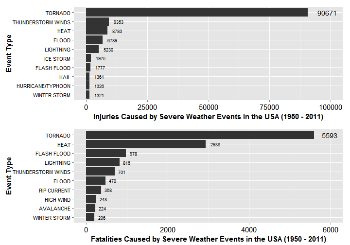

**REPRODUCIBLE RESEARCH**

**ASSIGNMENT 2**

**Mar 20, 2015**

=======================

# Tonadoes and Floods Inflicted the Most Damages in USA from 1950 to 2011

## 1. Synopsis

## 2. Data Processing

### Question 1: Across the United States, which types of events (as indicated in the EVTYPE variable) are most harmful with respect to population health?

Loading packages

```r
library(plyr)
library(data.table)
library(ggplot2)
library(gridExtra)
```

#### Variables relating to population health include fatalities and injuries. I first set out to check the relationships between types of events and fatalities, types of events and injuries, respectively. 

#### I first used "read.csv"" to load bz2 files, but it was painfully slow. Then I resorted to "fread" in the "data.table" package. It worked blazingly fast, except that there were constant error messages that blocked me from loading the entire database. 

#### After hours of trial and error, I gave up. I went on to extract manually the csv file from the raw bz2 archive, opened it in excel, and deleted the problematic column "REMARKS", which contained various characters that were a) meaningless for this research, and b) rendered read.csv/fread non-working. I saved the resultant csv file as "repdata-data-StormData-2.csv".

Part of the csv was loaded and I checked the names of columns.

```r
data_temp <- fread('repdata-data-StormData-2.csv', stringsAsFactors = FALSE, header = TRUE, nrow = 1000)
colnames(data_temp)
```

```
##  [1] "STATE__"    "BGN_DATE"   "BGN_TIME"   "TIME_ZONE"  "COUNTY"    
##  [6] "COUNTYNAME" "STATE"      "EVTYPE"     "BGN_RANGE"  "BGN_AZI"   
## [11] "BGN_LOCATI" "END_DATE"   "END_TIME"   "COUNTY_END" "COUNTYENDN"
## [16] "END_RANGE"  "END_AZI"    "END_LOCATI" "LENGTH"     "WIDTH"     
## [21] "F"          "MAG"        "FATALITIES" "INJURIES"   "PROPDMG"   
## [26] "PROPDMGEXP" "CROPDMG"    "CROPDMGEXP" "WFO"        "STATEOFFIC"
## [31] "ZONENAMES"  "LATITUDE"   "LONGITUDE"  "LATITUDE_E" "LONGITUDE_"
## [36] "REFNUM"     "V37"        "V38"        "V39"
```

It was decided that only columns of EVTYPE, INJURIES and MORTALITIES need to be loaded to answer the first question.

```r
data_event <- fread('repdata-data-StormData-2.csv', stringsAsFactors = FALSE, header = TRUE, select = c(8, 23, 24))
```

Then contents of the column EVTYPE needed to be cleaned up. I first loaded names of severe weather events from the National Weather Service website. 

```r
data_event$INDEX = as.numeric(row.names(data_event))
event_names = c('ASTRONOMICAL LOW TIDE', 'AVALANCHE', 'BLIZZARD', 'COASTAL FLOOD', 'COLD', 'DEBRIS FLOW', 'DENSE FOG', 'DENSE SMOKE', 'DROUGHT', 'DUST DEVIL', 'DUST STORM', 'EXCESSIVE HEAT', 'EXTREME COLD', 'FLASH FLOOD', 'FLOOD', 'FREEZING FOG', 'FROST', 'FREEZE', 'FUNNEL CLOUD', 'HAIL', 'HEAT', 'HEAVY RAIN', 'HEAVY SNOW', 'HIGH SURF', 'HURRICANE', 'TYPHOON', 'ICE STORM', 'LAKESHORE FLOOD', 'LAKE-EFFECT SNOW', 'LIGHTNING', 'MARINE HAIL', 'MARINE HIGH WIND', 'MARINE STRONG WIND', 'MARINE THUNDERSTORM WIND', 'RIP CURRENT', 'SEICHE', 'SLEET', 'STORM TIDE', 'STRONG WIND', 'THUNDERSTORM WIND', 'TORNADO', 'TROPICAL DEPRESSION', 'TROPICAL STORM', 'TSUNAMI', 'VOLCANIC ASH', 'WATERSPOUT', 'WILDFIRE', 'WINTER STORM', 'WINTER WEATHER')
```

Then I separated those lines of data that contained official names.

```r
data_event_captured = data_event[(data_event$EVTYPE == event_names[1]),]

for (i in 2:length(event_names)) {
    data_event_captured = rbind(data_event_captured, data_event[(data_event$EVTYPE == event_names[i]),])
}
```

Let us see what names of EVTYPES are not mentioned in the official guidance. (usually due to spelling, plural/singular forms, or errors)

```r
event_names_missed <- unique(data_event_captured$EVTYPE)
setdiff(event_names, event_names_missed)
```

```
## [1] "DEBRIS FLOW" "STORM TIDE"
```

I Checked if there are cases of setdiff results in data_event.

```r
subset(data_event, EVTYPE == 'DEBRIS FLOW')
```

```
## Empty data.table (0 rows) of 4 cols: EVTYPE,FATALITIES,INJURIES,INDEX
```

```r
subset(data_event, EVTYPE == 'STORM TIDE')
```

```
## Empty data.table (0 rows) of 4 cols: EVTYPE,FATALITIES,INJURIES,INDEX
```

Missed records were obtained

```r
data_event_missed_index = setdiff(data_event$INDEX, data_event_captured$INDEX)
data_event_missed <- data_event[(data_event_missed_index),]
```

Total injuries and fatalities of data_event_captured and data_event_missed were calculated.

```r
data_event_captured_tot <- ddply(data_event_captured, 'EVTYPE', summarize, INJURIES_TOT = sum(as.numeric(INJURIES)), FATALITIES_TOT = sum(as.numeric(FATALITIES)))
data_event_missed_tot <- ddply(data_event_missed, 'EVTYPE', summarize, INJURIES_TOT = sum(as.numeric(INJURIES)), FATALITIES_TOT = sum(as.numeric(FATALITIES)))
```

I calculated median of fatalities/injuries of data_event_captured_tot. Only those non-official EVTYPE datalines with a high enough total value were then included in the statistics.

```r
median(data_event_captured_tot$INJURIES_TOT)
```

```
## [1] 129
```

```r
median(data_event_captured_tot$FATALITIES_TOT)
```

```
## [1] 22
```

Major missed events were then identified.

```r
major_missed <- subset(data_event_missed_tot, (FATALITIES_TOT > 20 | INJURIES_TOT > 100))
```

From major_missed, I ditched "useless" EVTYPES and then, combined the meaningful ones into data_event_2

```r
event_names_2 = c('COLD/WIND CHILL', 'EXTREME COLD/WIND CHILL', 'EXTREME HEAT', 'FOG', 'GLAZE', 'HEAT WAVE', 'HEAVE SURF/HIGH SURF', 'HIGH WIND', 'HIGH WINDS', 'HURRICANE/TYPHOON', 'ICE', 'LANDSLIDE', 'RIP CURRENTS', 'THUNDERSTORM WINDS', 'TSTM WIND', 'URBAN/SML STREAM FLD', 'WILD FIRES', 'WILD/FOREST FIRE', 'WIND', 'WINTER WEATHER/MIX')

data_event_captured_2 = data_event[(data_event$EVTYPE == event_names_2[1]),]

for (i in 2:length(event_names_2)) {
    data_event_captured_2 = rbind(data_event_captured_2, data_event[(data_event$EVTYPE == event_names_2[i]),])
}

data_event_captured_2_tot <- ddply(data_event_captured_2, 'EVTYPE', summarize, INJURIES_TOT = sum(as.numeric(INJURIES)), FATALITIES_TOT = sum(as.numeric(FATALITIES)))
```

The two captured total datasets were combined

```r
data_event_captured_all_tot <- rbind(data_event_captured_tot, data_event_captured_2_tot) 
```

Merging hurricane/typhoon

```r
data_event_captured_all_tot[56,2:3] = (data_event_captured_all_tot[24, 2:3]) + (data_event_captured_all_tot[42, 2:3]) + (data_event_captured_all_tot[56, 2:3])
```

Thunderstorm = tstm

```r
data_event_captured_all_tot[60, 2:3] = (data_event_captured_all_tot[60, 2:3]) + (data_event_captured_all_tot[61, 2:3]) + (data_event_captured_all_tot[37, 2:3])
```

Combining heat, excessive heat and extreme heat

```r
data_event_captured_all_tot[20, 2:3] = (data_event_captured_all_tot[20, 2:3]) + (data_event_captured_all_tot[11, 2:3]) + (data_event_captured_all_tot[50, 2:3])
```

Deleting lines 24, 42, 61 and 37

```r
data_event_captured_all_tot <- data_event_captured_all_tot[-c(11, 24, 42, 37, 50, 61),]
```

I obtained the data of total injuries or fatalities in their respective upper quantiles. The numbers 686 and 125 were derived arbitrarily from the two lines of summary data below.

```r
summary(data_event_captured_all_tot$INJURIES_TOT)
```

```
##     Min.  1st Qu.   Median     Mean  3rd Qu.     Max. 
##     0.00     3.75   151.00  2310.00   592.20 90670.00
```

```r
summary(data_event_captured_all_tot$FATALITIES_TOT)
```

```
##    Min. 1st Qu.  Median    Mean 3rd Qu.    Max. 
##     0.0     2.0    30.5   243.5   125.0  5593.0
```

```r
data_event_top <- subset(data_event_captured_all_tot, INJURIES_TOT > 686 | FATALITIES_TOT > 125)
```

The data_event_top dataset was sorted.

```r
data_event_top_injuries <- data_event_top[order(data_event_top$INJURIES_TOT, decreasing = TRUE),][1:10,]
data_event_top_fatalities <- data_event_top[order(data_event_top$FATALITIES_TOT, decreasing = TRUE),][1:10,]
rownames(data_event_top_injuries) <- 1:nrow(data_event_top_injuries)
rownames(data_event_top_fatalities) <- 1:nrow(data_event_top_fatalities)
```

Final results were plotted then.

```r
positions_injuries <- rev(data_event_top_injuries$EVTYPE)
positions_fatalities <- rev(data_event_top_fatalities$EVTYPE)

plot1 <- ggplot(data_event_top_injuries, aes(x = EVTYPE, y = INJURIES_TOT, label = INJURIES_TOT)) + geom_bar(stat = 'identity') + scale_x_discrete(limits = positions_injuries, name = 'Event Type') + coord_flip() + scale_y_continuous(name = "Injuries Caused by Severe Weather Events in the USA (1950 - 2011)", limits = c(0, 100000)) + theme(axis.title.x = element_text(size=15, face = 'bold', vjust = 0), axis.title.y = element_text(size=15, face = 'bold'), axis.text.x = element_text(size=15, color = 'black'), axis.text.y = element_text(size=13, color='black')) + geom_text(hjust = -0.5, aes(size = INJURIES_TOT)) + scale_size(range = c(3,5)) + theme(legend.position = 'none')

plot2 <- ggplot(data_event_top_fatalities, aes(x = EVTYPE, y = FATALITIES_TOT, label = FATALITIES_TOT)) + geom_bar(stat = 'identity') + scale_x_discrete(limits = positions_fatalities, name = 'Event Type') + coord_flip() + scale_y_continuous(name = "Fatalities Caused by Severe Weather Events in the USA (1950 - 2011)", limits = c(0, 6000)) + theme(axis.title.x = element_text(size=15, face = 'bold', vjust = 0), axis.title.y = element_text(size=15, face = 'bold'), axis.text.x = element_text(size=15, color = 'black'), axis.text.y = element_text(size=13, color='black')) + geom_text(hjust = -0.5, aes(size = INJURIES_TOT)) + scale_size(range = c(3,5)) + theme(legend.position = 'none') 
```

##### FIGURE 1: Injuries and fatalities caused by severe weather events in the USA from 1950 to 2011. (Data source: National Weather Service)

```r
event_plot <- grid.arrange(plot1, plot2)
```

 

## Question 2 Across the United States, which types of events have the greatest economic consequences?

#### Apart from property and crop damages, I think injuries and fatalities should also be considered.

The columns of data to be analyzed for this purpose were identified.

```r
data_temp2 <- fread('repdata-data-StormData-2.csv', stringsAsFactors = FALSE, header = TRUE, nrow = 1000)
colnames(data_temp2)
```

```
##  [1] "STATE__"    "BGN_DATE"   "BGN_TIME"   "TIME_ZONE"  "COUNTY"    
##  [6] "COUNTYNAME" "STATE"      "EVTYPE"     "BGN_RANGE"  "BGN_AZI"   
## [11] "BGN_LOCATI" "END_DATE"   "END_TIME"   "COUNTY_END" "COUNTYENDN"
## [16] "END_RANGE"  "END_AZI"    "END_LOCATI" "LENGTH"     "WIDTH"     
## [21] "F"          "MAG"        "FATALITIES" "INJURIES"   "PROPDMG"   
## [26] "PROPDMGEXP" "CROPDMG"    "CROPDMGEXP" "WFO"        "STATEOFFIC"
## [31] "ZONENAMES"  "LATITUDE"   "LONGITUDE"  "LATITUDE_E" "LONGITUDE_"
## [36] "REFNUM"     "V37"        "V38"        "V39"
```

```r
data_eco <- fread('repdata-data-StormData-2.csv', stringsAsFactors = FALSE, header = TRUE, select = c(8, 23:28))
```

```
## 
Read 52.0% of 903870 rows
Read 903870 rows and 7 (of 39) columns from 0.194 GB file in 00:00:03
```


EVTYPE contents were cleaned up as above.

```r
data_eco$INDEX = as.numeric(row.names(data_eco))
event_names = c('ASTRONOMICAL LOW TIDE', 'AVALANCHE', 'BLIZZARD', 'COASTAL FLOOD', 'COLD', 'DEBRIS FLOW', 'DENSE FOG', 'DENSE SMOKE', 'DROUGHT', 'DUST DEVIL', 'DUST STORM', 'EXCESSIVE HEAT', 'EXTREME COLD', 'FLASH FLOOD', 'FLOOD', 'FREEZING FOG', 'FROST', 'FREEZE', 'FUNNEL CLOUD', 'HAIL', 'HEAT', 'HEAVY RAIN', 'HEAVY SNOW', 'HIGH SURF', 'HURRICANE', 'TYPHOON', 'ICE STORM', 'LAKESHORE FLOOD', 'LAKE-EFFECT SNOW', 'LIGHTNING', 'MARINE HAIL', 'MARINE HIGH WIND', 'MARINE STRONG WIND', 'MARINE THUNDERSTORM WIND', 'RIP CURRENT', 'SEICHE', 'SLEET', 'STORM TIDE', 'STRONG WIND', 'THUNDERSTORM WIND', 'TORNADO', 'TROPICAL DEPRESSION', 'TROPICAL STORM', 'TSUNAMI', 'VOLCANIC ASH', 'WATERSPOUT', 'WILDFIRE', 'WINTER STORM', 'WINTER WEATHER')

data_eco_captured = data_eco[(data_eco$EVTYPE == event_names[1]),]

for (i in 2:length(event_names)) {
    data_eco_captured = rbind(data_eco_captured, data_eco[(data_eco$EVTYPE == event_names[i]),])
}
```

Checking missing EVTYPES

```r
event_names_missed <- unique(data_eco_captured$EVTYPE)
setdiff(event_names, event_names_missed)
```

```
## [1] "DEBRIS FLOW" "STORM TIDE"
```

Checking if there are cases of setdiff results in data_event

```r
subset(data_eco, EVTYPE == 'DEBRIS FLOW')
```

```
## Empty data.table (0 rows) of 8 cols: EVTYPE,FATALITIES,INJURIES,PROPDMG,PROPDMGEXP,CROPDMG...
```

```r
subset(data_eco, EVTYPE == 'STORM TIDE')
```

```
## Empty data.table (0 rows) of 8 cols: EVTYPE,FATALITIES,INJURIES,PROPDMG,PROPDMGEXP,CROPDMG...
```

Obtaining missed records

```r
data_eco_missed_index = setdiff(data_eco$INDEX, data_eco_captured$INDEX)
data_eco_missed <- data_eco[(data_eco_missed_index),]
```


Picking out all data with viable property/crop damage data

```r
data_eco_captured_calc <- subset(data_eco_captured, (PROPDMGEXP == '' | PROPDMGEXP == 'B' | PROPDMGEXP == 'K' | PROPDMGEXP == 'M' | PROPDMGEXP == 'm') & (CROPDMGEXP == '' | CROPDMGEXP == 'B' | CROPDMGEXP == 'K' | CROPDMGEXP == 'k' | CROPDMGEXP == 'M'))

data_eco_missed_calc <- subset(data_eco_missed, (PROPDMGEXP == '' | PROPDMGEXP == 'B' | PROPDMGEXP == 'K' | PROPDMGEXP == 'M' | PROPDMGEXP == 'm') & (CROPDMGEXP == '' | CROPDMGEXP == 'B' | CROPDMGEXP == 'K' | CROPDMGEXP == 'k' | CROPDMGEXP == 'M'))
```

Then I calculated injuries, fatalities, and damages of data_event_captured and data_event_missed for various EVTYPES.

According to 'http://www.msha.gov/s&hinfo/costgenerator/costgenerator.htm', I set damage of USD 910k for one death, and USD 28k for one injury. 

```r
data_eco_captured_calc$PROPDMGTOT = 0
data_eco_captured_calc$CROPDMGTOT = 0
data_eco_captured_calc$DMGTOT = 0
data_eco_captured_calc$PROPDMGEXP2 = 0
data_eco_captured_calc$CROPDMGEXP2 = 0

data_eco_captured_calc[data_eco_captured_calc$PROPDMGEXP == 'B',]$PROPDMGEXP2 <- 1000000000
data_eco_captured_calc[data_eco_captured_calc$PROPDMGEXP == 'M',]$PROPDMGEXP2 <- 1000000
data_eco_captured_calc[data_eco_captured_calc$PROPDMGEXP == 'm',]$PROPDMGEXP2 <- 1000000
data_eco_captured_calc[data_eco_captured_calc$PROPDMGEXP == 'k',]$PROPDMGEXP2 <- 1000

data_eco_captured_calc[data_eco_captured_calc$CROPDMGEXP == 'B',]$CROPDMGEXP2 <- 1000000000
data_eco_captured_calc[data_eco_captured_calc$CROPDMGEXP == 'M',]$CROPDMGEXP2 <- 1000000
data_eco_captured_calc[data_eco_captured_calc$CROPDMGEXP == 'm',]$CROPDMGEXP2 <- 1000000
data_eco_captured_calc[data_eco_captured_calc$CROPDMGEXP == 'k',]$CROPDMGEXP2 <- 1000

data_eco_captured_calc$DMGTOT = as.numeric(data_eco_captured_calc$FATALITIES) * 910000 + as.numeric(data_eco_captured_calc$INJURIES) * 28000 + as.numeric(data_eco_captured_calc$PROPDMG) * data_eco_captured_calc$PROPDMGEXP2 + as.numeric(data_eco_captured_calc$CROPDMG) * data_eco_captured_calc$CROPDMGEXP2 

data_eco_missed_calc$PROPDMGTOT = 0
data_eco_missed_calc$CROPDMGTOT = 0
data_eco_missed_calc$DMGTOT = 0
data_eco_missed_calc$PROPDMGEXP2 = 0
data_eco_missed_calc$CROPDMGEXP2 = 0

data_eco_missed_calc[data_eco_missed_calc$PROPDMGEXP == 'B',]$PROPDMGEXP2 <- 1000000000
data_eco_missed_calc[data_eco_missed_calc$PROPDMGEXP == 'M',]$PROPDMGEXP2 <- 1000000
data_eco_missed_calc[data_eco_missed_calc$PROPDMGEXP == 'm',]$PROPDMGEXP2 <- 1000000
data_eco_missed_calc[data_eco_missed_calc$PROPDMGEXP == 'k',]$PROPDMGEXP2 <- 1000

data_eco_missed_calc[data_eco_missed_calc$CROPDMGEXP == 'B',]$CROPDMGEXP2 <- 1000000000
data_eco_missed_calc[data_eco_missed_calc$CROPDMGEXP == 'M',]$CROPDMGEXP2 <- 1000000
data_eco_missed_calc[data_eco_missed_calc$CROPDMGEXP == 'm',]$CROPDMGEXP2 <- 1000000
data_eco_missed_calc[data_eco_missed_calc$CROPDMGEXP == 'k',]$CROPDMGEXP2 <- 1000

data_eco_missed_calc$DMGTOT = as.numeric(data_eco_missed_calc$FATALITIES) * 910000 + as.numeric(data_eco_missed_calc$INJURIES) * 28000 + as.numeric(data_eco_missed_calc$PROPDMG) * data_eco_missed_calc$PROPDMGEXP2 + as.numeric(data_eco_missed_calc$CROPDMG) * data_eco_missed_calc$CROPDMGEXP2 

data_eco_captured_tot <- ddply(data_eco_captured_calc, 'EVTYPE', summarize, TOTAL = sum(DMGTOT))
data_eco_missed_tot <- ddply(data_eco_missed_calc, 'EVTYPE', summarize, TOTAL = sum(DMGTOT))
```


I looked for top 20 disasters that inflicted most damages.

```r
data_eco_top_captured <- data_eco_captured_tot[order(data_eco_captured_tot$TOTAL, decreasing = TRUE),][1:20,]
data_eco_top_missed <- data_eco_missed_tot[order(data_eco_missed_tot$TOTAL, decreasing = TRUE),][1:20,]
rownames(data_eco_top_captured) = c(1:nrow(data_eco_top_captured))
rownames(data_eco_top_missed) = c(1:nrow(data_eco_top_missed))
```

And then I did some clean up work.

hurricane/typhoon

```r
data_eco_top_captured[6,2] = data_eco_top_captured[6,2] + data_eco_top_captured[19,2] + data_eco_top_missed[1,2]
data_eco_top_captured[6,1] = 'HURRICANE/TYPHOON'
data_eco_top_missed <- data_eco_top_missed[-1,]
data_eco_top_captured <- data_eco_top_captured[-19,]
rownames(data_eco_top_missed) = c(1:nrow(data_eco_top_missed))
rownames(data_eco_top_captured) = c(1:nrow(data_eco_top_captured))
```

thunderstorm = tstm

```r
data_eco_top_captured[11,2] = data_eco_top_captured[11,2] + data_eco_top_missed[10,2] + data_eco_top_missed[5,2]
data_eco_top_missed <- data_eco_top_missed[-c(5,10),]
rownames(data_eco_top_missed) = c(1:nrow(data_eco_top_missed))
rownames(data_eco_top_captured) = c(1:nrow(data_eco_top_captured))
```

combining two top datasets and order

```r
data_eco_top <- rbind(data_eco_top_missed, data_eco_top_captured)
data_eco_top <- data_eco_top[order(data_eco_top$TOTAL, decreasing = TRUE),][1:20,]
rownames(data_eco_top) = c(1:nrow(data_eco_top))
```

Top10 of the data_eco_top were identified.

```r
data_eco_top <- data_eco_top[1:10,]
```

With damage cost data transformed to billions

```r
data_eco_top$TOTALB = data_eco_top$TOTAL / 1000000000
data_eco_top$TOTALB = round(data_eco_top$TOTALB, digits = 1)
```

Then the plot was made.

```r
positions_eco <- rev(data_eco_top$EVTYPE)

eco_plot <- ggplot(data_eco_top, aes(x = EVTYPE, y = TOTALB, label = TOTALB)) + geom_bar(stat = 'identity') + scale_x_discrete(limits = positions_eco, name = 'Event Type') + coord_flip() + scale_y_continuous(name = "Damages Caused by Severe Weather Events in the USA (1950 - 2011) ($ Billion) ", limits = c(0, 200)) + theme(axis.title.x = element_text(size=15, face = 'bold', vjust = 0), axis.title.y = element_text(size=15, face = 'bold'), axis.text.x = element_text(size=15, color = 'black'), axis.text.y = element_text(size=13, color='black')) + geom_text(hjust = -0.2, aes(size = TOTALB)) + scale_size(range = c(3,5)) + theme(legend.position = 'none')
```

##### FIGURE 2: Economic damages caused by severe weather events in the USA from 1950 to 2011. (Data source: National Weather Service)

```r
eco_plot
```

 


## 3. Results

## 4. Additional Thoughts


